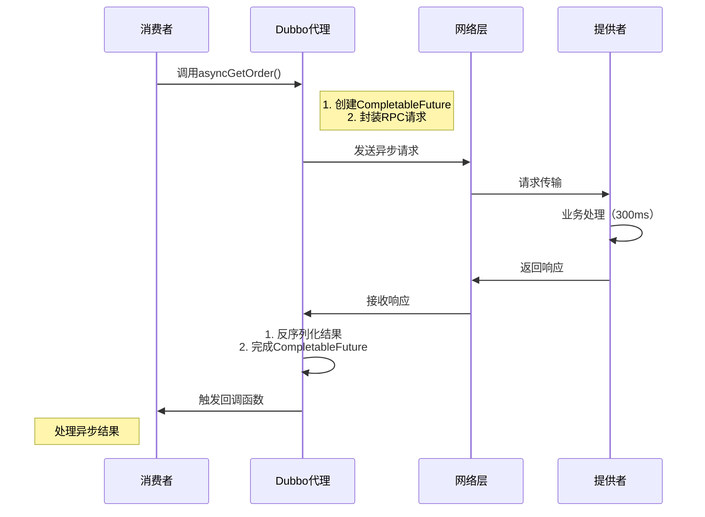

# 典型回答

Dubbo是支持异步进行调用的，有多种方式；
- **第一种**：分为Provider异步调用和Consumer异步调用
- **第二种**：基于CompletableFuture的异步调用（推荐）和基于RpcContext的异步调用

## 第一种
### Consumer异步调用
Consumer的异步调用比较容易理解，就是在调用方的地方自己做一个异步的处理。比如使用CompletableFuture来实现。

这种调用中，服务提供者提供的还是一个同步的同步接口，只不过调用方在调用的时候不需要同步等待结果，可以先去做其他事情，在需要用这个结果的时候再获取即可：
```java
@DubboReference
private AsyncService asyncService;

@Override
public void run(String... args) throws Exception {
    //consumer异步调用
    CompletableFuture<String> future3 =  CompletableFuture.supplyAsync(() -> {
        return asyncService.invoke("invoke call request");
    });
    future3.whenComplete((v, t) -> {
        if (t != null) {
            t.printStackTrace();
        } else {
            System.out.println("AsyncTask Response: " + v);
        }
    });

    System.out.println("AsyncTask Executed before response return.");
}
```

### Provider异步调用

还有一种方式就是Provider的异步调用，也就是说本身提供的就是一个异步接口。如：
```java
@DubboService
public class AsyncServiceImpl implements AsyncService {

    @Override
    public CompletableFuture<String> asyncInvoke(String param) {
        // 建议为supplyAsync提供自定义线程池
        return CompletableFuture.supplyAsync(() -> {
            try {
                // Do something
                long time = ThreadLocalRandom.current().nextLong(1000);
                Thread.sleep(time);
                StringBuilder s = new StringBuilder();
                s.append("AsyncService asyncInvoke param:").append(param).append(",sleep:").append(time);
                return s.toString();
            } catch (InterruptedException e) {
                Thread.currentThread().interrupt();
            }
            return null;
        });
    }
}
```

asyncInvoke方法的返回值就是一个CompletableFuture，调用者在调用这个方法时拿到的也是一个Future，在需要结果的时候调用Future的whenComplete方法即可：
```java
@DubboReference
private AsyncService asyncService;

@Override
public void run(String... args) throws Exception {
    //调用异步接口
    CompletableFuture<String> future1 = asyncService.asyncInvoke("async call request");
    future1.whenComplete((v, t) -> {
        if (t != null) {
            t.printStackTrace();
        } else {
            System.out.println("AsyncTask Response: " + v);
        }
    });
}
```

> Dubbo 2.6.x及之前版本中是使用的Future进行异步调用的，在java 8中引入的CompletableFuture之后，Dubbo 2.7开始使用CompletableFuture。

除了用CompletableFuture之外，Dubbo还提供了一个类似 Servlet 3.0 的异步接口AsyncContext也能用来实现异步调用。
```java
public class AsyncServiceImpl implements AsyncService {
    public String sayHello(String name) {
        final AsyncContext asyncContext = RpcContext.startAsync();
        new Thread(() -> {
            // 如果要使用上下文，则必须要放在第一句执行
            asyncContext.signalContextSwitch();
            try {
                Thread.sleep(500);
            } catch (InterruptedException e) {
                e.printStackTrace();
            }
            // 写回响应
            asyncContext.write("Hello " + name + ", response from provider.");
        }).start();
        return null;
    }
}
```

这里用了 RpcContext.startAsync()，可以把一个同步接口转为异步调用。

## 第二种


Dubbo提供了两种异步调用方式：**基于CompletableFuture的异步调用**（推荐）和**基于RpcContext的异步调用**。下面我将通过完整代码示例展示这两种实现方式。

### 环境准备
#### Maven依赖
```xml
<dependencies>
    <!-- Dubbo Spring Boot Starter -->
    <dependency>
        <groupId>org.apache.dubbo</groupId>
        <artifactId>dubbo-spring-boot-starter</artifactId>
        <version>3.2.0</version>
    </dependency>
    
    <!-- Nacos注册中心 -->
    <dependency>
        <groupId>com.alibaba.nacos</groupId>
        <artifactId>nacos-client</artifactId>
        <version>2.2.2</version>
    </dependency>
    
    <!-- Lombok -->
    <dependency>
        <groupId>org.projectlombok</groupId>
        <artifactId>lombok</artifactId>
        <version>1.18.28</version>
    </dependency>
</dependencies>
```

#### 公共接口定义
```java
// order-api模块: OrderService.java
public interface OrderService {
    // 同步方法
    OrderInfo getOrderById(Long orderId);
    
    // 异步方法定义（返回CompletableFuture）
    default CompletableFuture<OrderInfo> getOrderByIdAsync(Long orderId) {
        return CompletableFuture.completedFuture(getOrderById(orderId));
    }
}

// OrderInfo.java
@Data
@AllArgsConstructor
@NoArgsConstructor
public class OrderInfo implements Serializable {
    private Long orderId;
    private String orderNo;
    private BigDecimal amount;
    private Long userId;
}
```

### 方法一：基于CompletableFuture的异步调用（推荐）

#### 服务提供者实现
```java
@Service
@DubboService
public class OrderServiceImpl implements OrderService {
    
    // 模拟数据库
    private final Map<Long, OrderInfo> orderDB = new ConcurrentHashMap<>();
    
    public OrderServiceImpl() {
        // 初始化测试数据
        orderDB.put(1001L, new OrderInfo(1001L, "ORD2023001", new BigDecimal("199.99"), 2001L));
        orderDB.put(1002L, new OrderInfo(1002L, "ORD2023002", new BigDecimal("299.99"), 2002L));
    }

    @Override
    public OrderInfo getOrderById(Long orderId) {
        // 模拟业务处理耗时
        sleep(500);
        return orderDB.get(orderId);
    }

    @Override
    public CompletableFuture<OrderInfo> getOrderByIdAsync(Long orderId) {
        // 使用CompletableFuture.supplyAsync实现真正的异步处理
        return CompletableFuture.supplyAsync(() -> {
            // 模拟更复杂的异步处理
            sleep(300);
            return getOrderById(orderId);
        });
    }
    
    private void sleep(long millis) {
        try {
            Thread.sleep(millis);
        } catch (InterruptedException e) {
            Thread.currentThread().interrupt();
        }
    }
}
```

#### 服务消费者调用
```java
@Service
public class PaymentService {
    
    @DubboReference
    private OrderService orderService;
    
    /**
     * 方式1：使用CompletableFuture原生API
     */
    public void processOrderWithFuture(Long orderId) {
        long start = System.currentTimeMillis();
        
        // 发起异步调用
        CompletableFuture<OrderInfo> future = orderService.getOrderByIdAsync(orderId);
        
        System.out.println("异步调用发起完成，耗时: " + (System.currentTimeMillis() - start) + "ms");
        
        // 设置回调处理
        future.whenComplete((order, ex) -> {
            if (ex != null) {
                System.err.println("订单查询失败: " + ex.getMessage());
            } else {
                System.out.println("异步回调 - 订单信息: " + order);
                System.out.println("回调处理耗时: " + (System.currentTimeMillis() - start) + "ms");
            }
        });
        
        // 继续执行其他任务
        System.out.println("继续处理其他业务逻辑...");
    }
    
    /**
     * 方式2：使用CompletableFuture链式调用
     */
    public CompletableFuture<BigDecimal> calculateOrderAmount(Long orderId) {
        return orderService.getOrderByIdAsync(orderId)
                .thenApplyAsync(order -> {
                    // 模拟复杂计算
                    sleep(200);
                    return order.getAmount().multiply(new BigDecimal("0.9"));
                })
                .exceptionally(ex -> {
                    System.err.println("计算订单金额失败: " + ex.getMessage());
                    return BigDecimal.ZERO;
                });
    }
    
    // 测试方法
    public void testAsync() {
        // 测试方式1
        processOrderWithFuture(1001L);
        
        // 测试方式2
        calculateOrderAmount(1002L)
            .thenAccept(amount -> 
                System.out.println("折扣后金额: " + amount)
            );
    }
}
```

### 方法二：基于RpcContext的异步调用（传统方式）

#### 服务消费者实现
```java
@Service
public class LegacyPaymentService {
    
    @DubboReference
    private OrderService orderService;
    
    public void processOrderWithRpcContext(Long orderId) {
        long start = System.currentTimeMillis();
        
        // 1. 开启异步调用
        RpcContext.getServiceContext().asyncCall(() -> {
            // 此lambda会在异步线程执行
            return orderService.getOrderById(orderId);
        });
        
        System.out.println("异步调用发起完成，耗时: " + (System.currentTimeMillis() - start) + "ms");
        
        // 2. 获取异步Future
        CompletableFuture<OrderInfo> future = RpcContext.getServiceContext().getAsyncContext().getCompletableFuture();
        
        // 3. 处理异步结果
        future.whenComplete((order, ex) -> {
            if (ex != null) {
                System.err.println("订单查询失败: " + ex.getMessage());
            } else {
                System.out.println("RpcContext回调 - 订单信息: " + order);
                System.out.println("总耗时: " + (System.currentTimeMillis() - start) + "ms");
            }
        });
        
        // 继续执行其他任务
        System.out.println("继续处理其他业务逻辑...");
    }
}
```

### 异步调用配置

#### 全局异步配置（application.yml）
```yaml
dubbo:
  application:
    name: async-consumer
  registry:
    address: nacos://localhost:8848
  consumer:
    # 开启异步调用
    async: true
    # 设置超时时间
    timeout: 3000
  protocol:
    name: dubbo
    port: 20880
```

#### 方法级异步配置
```java
public interface OrderService {
    // 使用@Method注解配置异步调用
    @Method(
        name = "getOrderById", 
        async = true, 
        parameters = {
            @Parameter(key = "timeout", value = "2000")
        }
    )
    CompletableFuture<OrderInfo> getOrderByIdWithAnnotation(Long orderId);
}
```

### 异步调用执行流程



### 异步调用的关键优势

1. **非阻塞调用**：主线程不阻塞，提高系统吞吐量
2. **资源高效**：减少线程等待，优化线程池使用
3. **超时控制**：可设置每个异步调用的超时时间
4. **组合操作**：支持多个异步调用的链式组合
```java
CompletableFuture<OrderInfo> orderFuture = orderService.getOrderByIdAsync(1001L);
CompletableFuture<UserInfo> userFuture = userService.getUserAsync(2001L);

CompletableFuture<Void> combined = 
    CompletableFuture.allOf(orderFuture, userFuture)
        .thenRun(() -> {
            OrderInfo order = orderFuture.join();
            UserInfo user = userFuture.join();
            System.out.println("订单:" + order + " 用户:" + user);
        });
```

### 生产环境最佳实践

1. **线程池隔离**：为不同服务配置独立线程池
```yaml
dubbo:
  provider:
    threads: 200
    threadpool: fixed
    threadname: dubbo-server
  consumer:
    threadpool: cached
```

2. **超时与重试**：合理配置超时和重试策略
```java
@DubboReference(
    parameters = {
        "timeout", "3000",
        "retries", "2",
        "cluster", "failfast"
    }
)
private OrderService orderService;
```

3. **异步监控**：跟踪异步调用链
```java
future.whenComplete((result, ex) -> {
    Metrics.counter("rpc.call", "service", "OrderService")
           .increment();
    if (ex != null) {
        Metrics.counter("rpc.error", "service", "OrderService")
               .increment();
    }
});
```

4. **异常处理**：完善异常恢复机制
```java
orderService.getOrderByIdAsync(orderId)
    .exceptionally(ex -> {
        // 1. 记录日志
        log.error("订单查询失败", ex);
        // 2. 返回兜底数据
        return new OrderInfo(orderId, "DEFAULT_ORDER", BigDecimal.ZERO, 0L);
    });
```

### 总结

Dubbo异步调用的两种主要实现方式：

1. **CompletableFuture方式（推荐）**
   - 接口定义返回`CompletableFuture<T>`
   - 提供者实现异步处理逻辑
   - 消费者使用Future API处理结果

2. **RpcContext方式（传统）**
   - 使用`RpcContext.getServiceContext().asyncCall()`
   - 通过`getCompletableFuture()`获取结果
   - 适用于未预先定义异步接口的场景

关键优势：
- 提高系统吞吐量和资源利用率
- 支持复杂的异步操作组合
- 避免线程阻塞，提升响应速度
- 更好的超时控制和错误处理能力

在实际项目中，推荐使用CompletableFuture方式，它更符合现代Java编程范式，提供更简洁的API和更好的类型安全性。