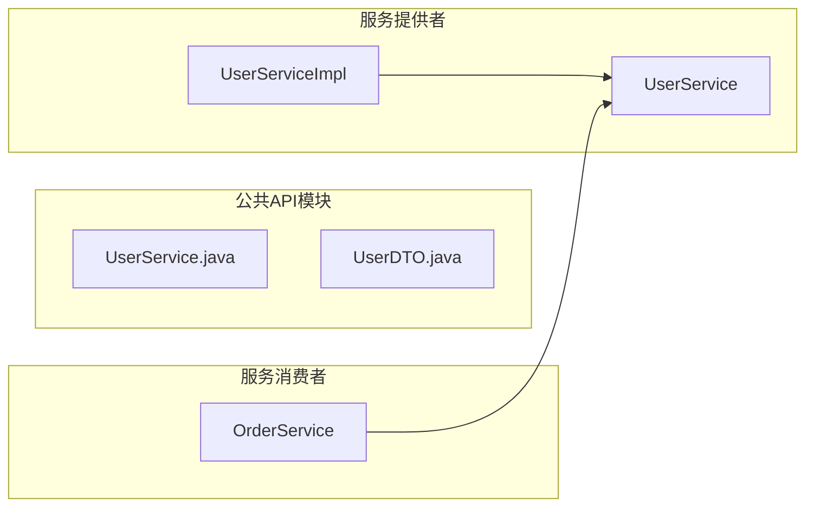
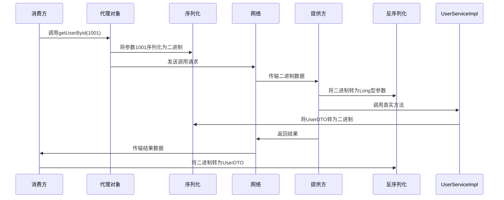

# 典型回答

下图，是Dubbo的整体设计的一张图片，网上的很多资料都是基于这个官方给的图片展开的：


但是这样图片太复杂了，如果大家想要自己看源码，可以结合它来看，但是面试的时候回答问题，就不可能搞的这么细，所以主要还是介绍思想。（这里讲实现方式，具体的调用过程见：[https://www.yuque.com/hollis666/io9xi1/nn5fo1yz2b2f9lgy](https://www.yuque.com/hollis666/io9xi1/nn5fo1yz2b2f9lgy)）

大家看着这样图，其实是有分层的。一共分成了以下几个层：
- **config 配置层**：对外配置接口，以 ServiceConfig, ReferenceConfig 为中心，可以直接初始化配置类，也可以通过 spring 解析配置生成配置类
- **proxy 服务代理层**：服务接口透明代理，生成服务的客户端 Stub 和服务器端 Skeleton, 以 ServiceProxy 为中心，扩展接口为 ProxyFactory
- **registry 注册中心层**：封装服务地址的注册与发现，以服务 URL 为中心，扩展接口为 RegistryFactory, Registry, RegistryService
- **cluster 路由层**：封装多个提供者的路由及负载均衡，并桥接注册中心，以 Invoker 为中心，扩展接口为 Cluster, Directory, Router, LoadBalance
- **monitor 监控层**：RPC 调用次数和调用时间监控，以 Statistics 为中心，扩展接口为 MonitorFactory, Monitor, MonitorService
- **protocol 远程调用层**：封装 RPC 调用，以 Invocation, Result 为中心，扩展接口为 Protocol, Invoker, Exporter
- **exchange 信息交换层**：封装请求响应模式，同步转异步，以 Request, Response 为中心，扩展接口为 Exchanger, ExchangeChannel, ExchangeClient, ExchangeServer
- **transport 网络传输层**：抽象 mina 和 netty 为统一接口，以 Message 为中心，扩展接口为 Channel, Transporter, Client, Server, Codec
- **serialize 数据序列化层**：可复用的一些工具，扩展接口为 Serialization, ObjectInput, ObjectOutput, ThreadPool

我把这里面比较重要的部分单独拿出来，试着简化一下整个调用过程，让大家更容易理解dubbo实现远程调用的主要原理。

Dubbo 实现像本地方法一样调用远程方法的核心技术是**动态代理**。<font color = "red">Dubbo 使用 JDK 动态代理或者字节码增强技术，生成一个代理类，该代理类实现了本地接口，具有本地接口的所有方法。在调用本地接口方法时，会通过代理类的 invoke 方法将请求转发到远程服务提供者上。</font>


**生成代理类**，Dubbo 在启动时会扫描配置文件（注解）中指定的服务接口，并根据服务接口生成一个代理类。这个代理类实现了服务接口，并且在调用服务接口的方法时，会将参数封装成请求消息，然后通过网络传输给服务提供方。

**序列化与反序列化**，为了在网络上发送和接收数据，Dubbo将方法调用的参数和返回值进行序列化（转换成字节序列）和反序列化（从字节序列还原数据）。Dubbo目前支持多种序列化协议：Dubbo支持多种序列化协议，如Hessian、Java自带的序列化、JSON等，以适应不同的性能和兼容性需求。

**网络通信**，Dubbo 支持多种通信协议，包括 Dubbo 协议、HTTP 协议、Hessian 协议等。在配置文件中指定了要使用的通信协议后，Dubbo 会根据协议的不同，选择不同的序列化方式，将请求消息序列化成二进制流并发送给服务提供方。

**服务注册与发现**，Dubbo使用注册中心（如Zookeeper、Nacos等）管理服务的提供者和消费者信息。服务提供者在启动时将自己提供的服务注册到注册中心，服务消费者通过注册中心查找所需的服务并获取服务提供者的地址。

**负载均衡**，Dubbo 支持多种负载均衡算法，包括轮询、随机、加权随机、最小活跃数等。在客户端发起调用时，Dubbo 会根据负载均衡算法选择一台服务提供方进行调用。

**远程服务执行**，当客户端发起远程调用后，服务提供方接收到请求后，会根据请求中的服务接口名和方法名，找到对应的实现类和方法，并将请求消息反序列化成参数列表，最终调用服务实现类的方法，并将执行结果序列化成响应消息返回给客户端。

# 扩展知识

#Dubbo的接口共享机制 #分布式架构中代码复用 #接口共享契约

## 问题描述

服务提供者和服务消费者部署在不同的机器上，服务消费者怎么能用 JDK 动态代理调用服务提供者的方法？难道消费者也有提供者的接口代码吗？

**答案**：在分布式系统中，**服务调用方不应该直接依赖服务提供者的具体实现代码**。Dubbo 通过"接口共享 + 动态代理 + 序列化"的机制解决这个问题，下面我用实际代码演示完整流程：

---

### 解决方案：接口共享契约
Dubbo 的核心设计是**服务接口作为双方契约**，服务提供方和消费方**共享接口定义但不共享实现**：



---

### 代码实现（基于Spring Boot + Dubbo 3.x）

#### 步骤1：创建公共接口模块（独立JAR）
```java
// user-api/src/main/java/com/example/UserService.java
public interface UserService {
    UserDTO getUserById(Long id);
}

// user-api/src/main/java/com/example/UserDTO.java
public class UserDTO implements Serializable {
    private Long id;
    private String name;
    private String email;
    // 必须有无参构造器
    // 必须实现Serializable
    // getters/setters
}
```

将此模块打包为独立JAR：`mvn install`

---

#### 步骤2：服务提供方（实现接口）
```xml
<!-- provider/pom.xml -->
<dependency>
    <groupId>com.example</groupId>
    <artifactId>user-api</artifactId>
    <version>1.0</version>
</dependency>
```

```java
// provider/src/main/java/com/example/provider/UserServiceImpl.java
@DubboService // Dubbo服务注解
public class UserServiceImpl implements UserService { // 实现公共接口
    @Override
    public UserDTO getUserById(Long id) {
        // 实际数据库操作
        return new UserDTO(id, "张三", "zhangsan@example.com");
    }
}
```

---

#### 步骤3：服务消费方（仅依赖接口）
```xml
<!-- consumer/pom.xml -->
<dependency>
    <groupId>com.example</groupId>
    <artifactId>user-api</artifactId>
    <version>1.0</version>
</dependency>
```

```java
// consumer/src/main/java/com/example/consumer/OrderService.java
@Service
public class OrderService {
    // Dubbo自动注入代理对象
    @DubboReference
    private UserService userService; // 仅依赖接口

    public void processOrder(Long userId) {
        // 像调用本地方法一样调用远程服务
        UserDTO user = userService.getUserById(userId);
        System.out.println("处理订单，用户: " + user.getName());
    }
}
```

---

### 关键机制解析

#### 1. 动态代理生成原理
当消费方启动时，Dubbo 通过字节码技术动态生成代理类：

```java
// Dubbo自动生成的代理类（伪代码）
public class UserService$Proxy implements UserService {
    private final Invoker invoker;
    
    public UserDTO getUserById(Long id) {
        // 1. 构造RPC调用对象
        RpcInvocation invocation = new RpcInvocation(
            "getUserById", 
            new Class[]{Long.class}, 
            new Object[]{id}
        );
        
        // 2. 通过网络发送调用请求
        Result result = invoker.invoke(invocation);
        
        // 3. 反序列化结果
        return (UserDTO) result.getValue();
    }
}
```

#### 2. 接口与实现分离
| 组件      | 依赖关系         | 是否打包部署  |
| ------- | ------------ | ------- |
| 公共API模块 | 被提供方和消费方共同依赖 | 不包含具体实现 |
| 服务提供方   | 实现接口 + 业务逻辑  | 部署实现类   |
| 服务消费方   | 仅依赖接口        | 不部署实现类  |

#### 3. 序列化机制
当调用 `getUserById(1001)` 时：


---

### 为什么不需要提供方实现类？

1. **接口即契约**  
   消费方只需要知道方法签名和返回类型，不需要知道实现细节

2. **动态代理技术**  
   Dubbo 在运行时生成接口的代理实现，处理网络通信细节：
   ```java
   UserService proxy = ProxyFactory.getProxy(UserService.class);
   ```

3. **序列化协议**  
   使用 Hessian2/Kryo 等跨语言序列化协议传输数据：
   ```java
   // 消费方序列化
   byte[] req = serializer.serialize(methodName, params);
   
   // 提供方反序列化
   Object[] args = deserializer.deserialize(req);
   ```

4. **注册中心协调**  
   Zookeeper/Nacos 存储接口与实现位置的映射关系：
   ```mermaid
   graph LR
   提供方-- 注册 -->ZK[注册中心]
   消费方-- 发现 -->ZK
   ```

---

### 处理接口变更
当接口需要升级时，Dubbo 提供优雅解决方案：

```java
// 公共API模块 v2
public interface UserService {
    // 保持兼容的老方法
    @Deprecated
    UserDTO getUserById(Long id);
    
    // 新方法
    UserDTO getUserByIdWithCache(Long id, boolean useCache);
}
```

消费方逐步迁移：
```java
// 消费方可选择老方法或新方法
@DubboReference(version = "1.0")
private UserService v1Service;

@DubboReference(version = "2.0")
private UserService v2Service;
```

---

### 总结：Dubbo 的透明化 RPC 实现
1. **接口共享**  
   通过独立JAR包共享接口定义
2. **动态代理**  
   运行时生成代理类处理网络通信
3. **契约优先**  
   接口作为服务契约，解耦提供方与消费方
4. **序列化透明**  
   自动处理参数和返回值的序列化
5. **版本控制**  
   支持平滑的接口演进

这种设计使得：
- 消费方只需依赖接口声明
- 提供方专注业务实现
- 双方独立部署升级
- 真正实现"像调用本地方法一样调用远程服务"


