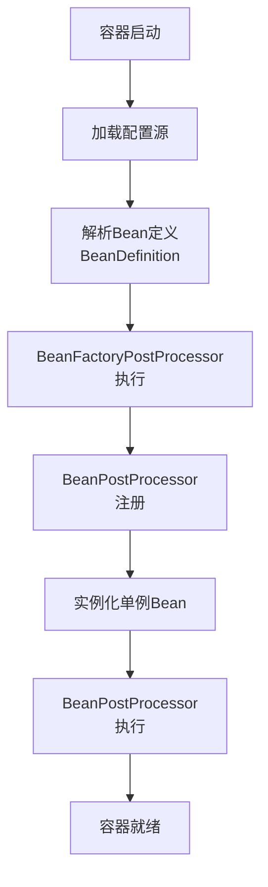

# 1、BeanPostProcessor接口

位置：`package org.springframework.beans.factory.config;`

`BeanPostProcessor` 是Spring框架中的一个接口，它定义了在Spring容器中初始化Bean的过程中，可以在Bean实例化之前和之后执行自定义逻辑的方法。其中，`postProcessBeforeInitialization`方法在Bean初始化之前调用，而`postProcessAfterInitialization`方法在Bean初始化之后调用。

## 1.1、常用方法

1. `postProcessBeforeInitialization(Object bean, String beanName)`

   - 方法签名：`Object postProcessBeforeInitialization(Object bean, String beanName)`
   - 参数：
     - `bean`：正在初始化的Bean实例
     - `beanName`：正在初始化的Bean的名称
   - 返回值：初始化之前的Bean实例，可以是原始实例或经过修改的实例
   - 作用：在Bean初始化之前执行自定义逻辑，可以对Bean进行一些前置处理，如属性设置、代理对象的创建等。

2. `postProcessAfterInitialization(Object bean, String beanName)`

   - 方法签名：`Object postProcessAfterInitialization(Object bean, String beanName)`
   - 参数：
     - `bean`：已经初始化的Bean实例
     - `beanName`：已经初始化的Bean的名称
   - 返回值：初始化之后的Bean实例，可以是原始实例或经过修改的实例
   - 作用：在Bean初始化之后执行自定义逻辑，可以对Bean进行一些后置处理，如添加额外的功能、修改属性值等。

通过实现`BeanPostProcessor`接口，并重写这两个方法，你可以在Bean初始化的不同阶段进行自定义的处理逻辑。这对于需要在Bean实例化和初始化过程中进行额外处理的场景非常有用，比如在Bean初始化之前执行一些定制化的逻辑，或者在Bean初始化之后对Bean做一些进一步的处理。

希望这能帮助到你，如果你还有其他问题，请随时提问。

## 1.2、适用场景
### 1.2.1. **初始化回调处理**

**场景**：在Bean初始化前后执行自定义操作（如日志、验证等）
```java
@Component
public class LoggingBeanPostProcessor implements BeanPostProcessor {
    
    @Override
    public Object postProcessBeforeInitialization(Object bean, String beanName) {
        System.out.println("【初始化前】Bean: " + beanName);
        return bean; // 必须返回原始或修改后的Bean
    }
    
    @Override
    public Object postProcessAfterInitialization(Object bean, String beanName) {
        System.out.println("【初始化后】Bean: " + beanName);
        return bean;
    }
}
```

### 1.2.2. **Aware接口回调（实现依赖注入）**

**场景**：为实现了`Aware`接口（如`BeanNameAware`）的Bean注入依赖
```java
@Component
public class CustomAwareProcessor implements BeanPostProcessor {
    
    @Override
    public Object postProcessBeforeInitialization(Object bean, String beanName) {
        if (bean instanceof BeanNameAware beanNameAware) {
            beanNameAware.setBeanName(beanName); // 注入Bean名称
        }
        if (bean instanceof ApplicationContextAware ctxAware) {
            ctxAware.setApplicationContext(applicationContext); // 注入ApplicationContext
        }
        return bean;
    }
}
```

### 1.2.3. **代理增强（AOP前置操作）**

**场景**：为特定Bean创建代理（如实现简单AOP）
```java
@Component
public class ProxyEnhancerPostProcessor implements BeanPostProcessor {
    
    @Override
    public Object postProcessAfterInitialization(Object bean, String beanName) {
        if (bean instanceof UserService) {
            return Proxy.newProxyInstance(
                bean.getClass().getClassLoader(),
                bean.getClass().getInterfaces(),
                (proxy, method, args) -> {
                    System.out.println("【代理】执行方法: " + method.getName());
                    return method.invoke(bean, args);
                }
            );
        }
        return bean;
    }
}
```

### 1.2.4. **自定义注解处理**

**场景**：处理标记了自定义注解的Bean（如自动注入配置）
```java
@Component
public class CustomAnnotationProcessor implements BeanPostProcessor {
    
    @Override
    public Object postProcessBeforeInitialization(Object bean, String beanName) {
        Class<?> clazz = bean.getClass();
        if (clazz.isAnnotationPresent(Encrypt.class)) {
            // 处理带@Encrypt注解的Bean
            return encryptBean(bean);
        }
        return bean;
    }
    
    private Object encryptBean(Object bean) { ... }
}
```

### 1.2.5. **属性修改（元数据处理）**

**场景**：动态修改Bean属性值
```java
@Component
public class PropertyOverrideProcessor implements BeanPostProcessor {
    
    @Override
    public Object postProcessAfterInitialization(Object bean, String beanName) {
        if (bean instanceof DataSource dataSource) {
            dataSource.setUrl("jdbc:custom://new-url"); // 覆盖数据源配置
        }
        return bean;
    }
}
```

### 1.2.6.关键特性总结：

|特性|说明|
|---|---|
|**执行时机**|`BeforeInitialization`：在`@PostConstruct`/`InitializingBean`之前  <br>`AfterInitialization`：在初始化方法之后|
|**作用范围**|全局生效（处理容器中所有Bean）|
|**执行顺序**|可通过`Ordered`接口或`@Order`注解控制多个处理器的顺序|
|**原型Bean支持**|每次获取原型Bean时都会执行|
|**与AOP交互**|在AOP代理之前执行（若需处理代理对象，需在`postProcessAfterInitialization`中操作）|

### 1.2.7.注意事项：
1. **避免在处理器中创建Bean**  
    在`BeanPostProcessor`中调用`applicationContext.getBean()`可能导致循环依赖
2. **条件过滤**  
    使用`instanceof`或注解检查确保只处理特定Bean，避免性能损耗
3. **与`BeanFactoryPostProcessor`区别**


> **最佳实践**：优先使用标准生命周期回调（如`@PostConstruct`），仅在需要全局控制时才使用`BeanPostProcessor`。

通过`BeanPostProcessor`，Spring提供了高度灵活的扩展点，是实现框架级功能（如AOP、事务管理）的基础机制。

# 2、ResponseBodyEmitter类

位置：`org.springframework.web.servlet.mvc.method.annotation.ResponseBodyEmitter`

`org.springframework.web.servlet.mvc.method.annotation.ResponseBodyEmitter` 是 Spring Framework 中的一个类，用于在 Spring MVC 中支持异步请求处理。它允许你在处理 HTTP 请求时，逐步发送数据到客户端，而不需要等到整个请求处理完成后才发送所有数据，从而实现了更高效的长连接、服务器推送以及流式传输等需求。

## 2.1、主要功能和特点

1. **异步响应**: 允许在主线程外处理请求，提供更高的吞吐量和响应能力。
2. **分块发送数据**: 支持将数据分块发送到客户端，而不是一次性返回所有数据。
3. **长连接和服务器推送**: 适用于需要长时间保持连接的场景，如 SSE（Server-Sent Events）。

## 2.2、使用方式

下面是一个使用 `ResponseBodyEmitter` 的简单示例：

1. **Controller**: 定义一个控制器方法，返回 `ResponseBodyEmitter` 对象。

```java
import org.springframework.web.bind.annotation.GetMapping;
import org.springframework.web.bind.annotation.RestController;
import org.springframework.web.servlet.mvc.method.annotation.ResponseBodyEmitter;

@RestController
public class MyController {

    @GetMapping("/stream")
    public ResponseBodyEmitter handle() {
        ResponseBodyEmitter emitter = new ResponseBodyEmitter();
        new Thread(() -> {
            try {
                for (int i = 0; i < 5; i++) {
                    emitter.send("Message " + i + "\n");
                    Thread.sleep(1000); // 模拟一些延迟
                }
                emitter.complete();
            } catch (Exception e) {
                // 调用 `completeWithError` 方法将错误信息发送到客户端。
                emitter.completeWithError(e);
            }
        }).start();
        return emitter;
    }
}
```

2. **启动应用**: 运行 Spring Boot 应用程序，然后访问 `/stream` 端点。

## 2.3、解释

- **`ResponseBodyEmitter` 对象**: 这个对象用于逐步发送数据给客户端。你可以使用 `send()` 方法发送数据，使用 `complete()` 方法表示发送完成，使用 `completeWithError(Throwable ex)` 方法在发生错误时通知客户端。

- **异步处理**: 通过在单独的线程中进行数据发送，避免阻塞主线程，提高并发处理能力。

## 2.4、适用场景

- **实时数据更新**: 例如股票行情、天气信息等，需要实时更新数据给客户端。
- **长连接应用**: 例如聊天室、游戏等需要保持长时间连接的应用。
- **流式数据传输**: 例如大文件分块传输、大数据量分批次传输等。

## 2.5、与其他异步处理方式的比较

- **DeferredResult**: 适用于单次结果返回，而 `ResponseBodyEmitter` 适用于多次结果分块返回。
- **SseEmitter**: 专门用于服务器推送事件（SSE）的子类，提供了一些简化的 API 以支持 SSE 协议。

## 2.6、常用方法

- **`send(Object data)`**:
    - 发送一个对象到客户端。这个对象会被转换为适当的格式（例如 JSON）。
- **`send(Object data, MediaType mediaType)`**:
    - 发送一个对象到客户端，并指定其媒体类型（Content-Type）。
- **`complete()`**:
    - 通知客户端数据发送完毕。
- **`completeWithError(Throwable ex)`**:
    - 发送错误信息到客户端，并结束数据发送。
- **`onTimeout(Runnable callback)`**:
    - 设置一个超时回调函数，当数据发送超时时会被调用。
- **`onError(Consumer<Throwable> callback)`**:
    - 设置一个错误回调函数，当发送数据出错时会被调用。
- **`onCompletion(Runnable callback)`**:
    - 设置一个完成回调函数，当数据发送完成时会被调用。


## 2.7、总结

`ResponseBodyEmitter` 是 Spring MVC 中一个强大且灵活的类，适用于需要异步处理和分块传输数据的场景。通过使用 `ResponseBodyEmitter`，可以提高服务器的响应能力和并发处理能力，适应现代 Web 应用中复杂多变的需求。

# 3、BeanFactoryPostProcessor

`BeanFactoryPostProcessor` 是 Spring 框架中非常重要的扩展点。

## 3.1、定义与定位

`BeanFactoryPostProcessor` 是 Spring 框架中的一个核心接口，位于 `org.springframework.beans.factory.config` 包中。它的主要作用是在 **==Spring 容器实例化任何 Bean 之前，读取和修改 Bean 的定义（`BeanDefinition`）==**，*==自动装配就是依赖它==*。

### 3.1.1、在 Spring 容器生命周期中的位置

为了清晰理解它的作用时机，我们先看 Spring 容器的启动流程：



**关键时机**：`BeanFactoryPostProcessor` 在 Bean 定义加载完成后、Bean 实例化之前执行。

## 3.2、核心作用

### 3.2.1、修改 Bean 的定义信息

可以修改 Bean 的类名、作用域、属性值、构造函数参数等配置元数据。

### 3.2.2、添加或移除 Bean 定义

可以动态地向容器中注册新的 Bean 定义，或删除已有的 Bean 定义。

### 3.2.3、处理占位符解析

最经典的例子就是 `PropertySourcesPlaceholderConfigurer`，它负责解析 `${...}` 占位符。

## 3.3、接口定义

```java
@FunctionalInterface
public interface BeanFactoryPostProcessor {
    void postProcessBeanFactory(ConfigurableListableBeanFactory beanFactory) 
        throws BeansException;
}
```

- **参数**：`ConfigurableListableBeanFactory` - 可配置的 Bean 工厂，提供了访问和修改 Bean 定义的方法
- **执行时机**：在所有 Bean 定义加载完成后，但在任何 Bean 实例化之前

## 3.4、核心使用方法

### 3.4.1、访问和修改 Bean 定义

```java
@Component
public class CustomBeanFactoryPostProcessor implements BeanFactoryPostProcessor {

    @Override
    public void postProcessBeanFactory(ConfigurableListableBeanFactory beanFactory) 
            throws BeansException {
        
        // 获取 Bean 定义注册表
        BeanDefinitionRegistry registry = (BeanDefinitionRegistry) beanFactory;
        
        // 遍历所有 Bean 名称
        for (String beanName : beanFactory.getBeanDefinitionNames()) {
            BeanDefinition beanDefinition = beanFactory.getBeanDefinition(beanName);
            
            // 示例：修改特定 Bean 的作用域
            if ("myService".equals(beanName)) {
                beanDefinition.setScope(BeanDefinition.SCOPE_PROTOTYPE);
            }
            
            // 示例：修改属性值
            MutablePropertyValues propertyValues = beanDefinition.getPropertyValues();
            if (propertyValues.contains("timeout")) {
                propertyValues.add("timeout", 5000); // 修改超时时间
            }
        }
    }
}
```

### 3.4.2、动态注册新的 Bean 定义

```java
@Component
public class DynamicBeanRegistrationPostProcessor implements BeanFactoryPostProcessor {

    @Override
    public void postProcessBeanFactory(ConfigurableListableBeanFactory beanFactory) 
            throws BeansException {
        
        BeanDefinitionRegistry registry = (BeanDefinitionRegistry) beanFactory;
        
        // 创建新的 Bean 定义
        GenericBeanDefinition newBeanDefinition = new GenericBeanDefinition();
        newBeanDefinition.setBeanClass(AdditionalService.class);
        newBeanDefinition.getPropertyValues().add("name", "Dynamic Bean");
        
        // 注册到容器中
        registry.registerBeanDefinition("additionalService", newBeanDefinition);
        
        // 也可以移除已有的 Bean 定义
        if (registry.containsBeanDefinition("obsoleteBean")) {
            registry.removeBeanDefinition("obsoleteBean");
        }
    }
}
```

## 3.5、Spring 内置的重要实现

### 3.5.1、PropertySourcesPlaceholderConfigurer
处理属性占位符 `${...}` 的解析：

```java
@Configuration
public class AppConfig {
    
    @Bean
    public static PropertySourcesPlaceholderConfigurer propertyConfigurer() {
        PropertySourcesPlaceholderConfigurer configurer = 
            new PropertySourcesPlaceholderConfigurer();
        configurer.setLocation(new ClassPathResource("application.properties"));
        return configurer;
    }
    
    @Bean
    public DataSource dataSource(
            @Value("${db.url}") String url,
            @Value("${db.username}") String username,
            @Value("${db.password}") String password) {
        // 使用解析后的属性值创建 Bean
        return new DriverManagerDataSource(url, username, password);
    }
}
```

### 3.5.2、PropertyOverrideConfigurer
允许从属性文件覆盖 Bean 属性值：

```java
@Bean
public static PropertyOverrideConfigurer propertyOverrideConfigurer() {
    PropertyOverrideConfigurer configurer = new PropertyOverrideConfigurer();
    configurer.setLocation(new ClassPathResource("overrides.properties"));
    return configurer;
}
```

在 `overrides.properties` 中：
```properties
userService.timeout=3000
dataSource.url=jdbc:mysql://localhost:3306/test
```

### 3.5.3、CustomEditorConfigurer
注册自定义的属性编辑器：

```java
@Bean
public static CustomEditorConfigurer customEditorConfigurer() {
    CustomEditorConfigurer configurer = new CustomEditorConfigurer();
    configurer.setCustomEditors(Collections.singletonMap(
        Date.class, CustomDateEditor.class
    ));
    return configurer;
}
```

## 3.6、实际应用场景

### 场景1：在 Spring Boot 中的自动配置

Spring Boot 大量使用 `BeanFactoryPostProcessor` 来实现自动配置：

```java
// Spring Boot 自动配置的核心机制
public class AutoConfigurationImportSelector 
    implements DeferredImportSelector, BeanClassLoaderAware, ... {
    
    // 通过 BeanFactoryPostProcessor 机制动态注册自动配置类
}
```

### 场景2：环境特定的配置覆盖

```java
@Component
public class EnvironmentAwarePostProcessor implements BeanFactoryPostProcessor {
    
    @Override
    public void postProcessBeanFactory(ConfigurableListableBeanFactory beanFactory) 
            throws BeansException {
        
        String environment = System.getProperty("spring.profiles.active", "dev");
        
        for (String beanName : beanFactory.getBeanDefinitionNames()) {
            BeanDefinition beanDefinition = beanFactory.getBeanDefinition(beanName);
            
            // 根据环境修改配置
            if ("emailService".equals(beanName) && "prod".equals(environment)) {
                beanDefinition.getPropertyValues().add("retryAttempts", 5);
                beanDefinition.getPropertyValues().add("timeout", 10000);
            }
        }
    }
}
```

### 场景3：条件化 Bean 注册

```java
@Component
public class ConditionalBeanPostProcessor implements BeanFactoryPostProcessor {
    
    @Override
    public void postProcessBeanFactory(ConfigurableListableBeanFactory beanFactory) 
            throws BeansException {
        
        BeanDefinitionRegistry registry = (BeanDefinitionRegistry) beanFactory;
        
        // 检查类路径中是否存在特定类
        if (isClassPresent("com.example.SpecialFeature")) {
            // 动态注册特定功能相关的 Bean
            GenericBeanDefinition featureBean = new GenericBeanDefinition();
            featureBean.setBeanClass(SpecialFeatureService.class);
            registry.registerBeanDefinition("specialFeatureService", featureBean);
        }
    }
    
    private boolean isClassPresent(String className) {
        try {
            Class.forName(className);
            return true;
        } catch (ClassNotFoundException e) {
            return false;
        }
    }
}
```

## 3.7、与 BeanPostProcessor 的区别

这是一个重要的对比：

| 特性   | BeanFactoryPostProcessor                | BeanPostProcessor  |
| ---- | --------------------------------------- | ------------------ |
| 作用对象 | **Bean 的定义（==BeanDefinition的创建、修改等==）** | **==Bean 的实例==**   |
| 执行时机 | Bean 实例化之前                              | Bean 实例化之后，初始化前后   |
| 修改内容 | 修改 Bean 的元数据                            | 修改 Bean 实例本身       |
| 使用场景 | 全局配置修改、条件化注册                            | AOP 代理、属性注入、生命周期回调 |

## 3.8、最佳实践和注意事项

1. **执行顺序**：可以通过实现 `Ordered` 接口或使用 `@Order` 注解控制执行顺序
2. **性能考虑**：避免在 `BeanFactoryPostProcessor` 中执行耗时操作
3. **谨慎修改**：修改 Bean 定义可能影响容器稳定性
4. **静态方法**：如果通过 `@Bean` 方式注册，方法必须是 `static` 的：

```java
@Configuration
public class Config {
    
    @Bean
    public static CustomBeanFactoryPostProcessor customPostProcessor() {
        return new CustomBeanFactoryPostProcessor();
    }
}
```

## 总结

**`BeanFactoryPostProcessor` 是 Spring 框架中一个极其强大的扩展点，它==允许开发者在 Bean 实例化之前干预容器的配置过程==。通过它，我们可以实现属性占位符解析、条件化配置、动态 Bean 注册等高级功能，是理解 Spring 容器工作机制和实现自定义扩展的关键。**

**核心价值**：提供了在 Spring 容器生命周期的早期阶段进行定制化处理的能力，是实现框架级功能（如 Spring Boot 自动配置）的基础。