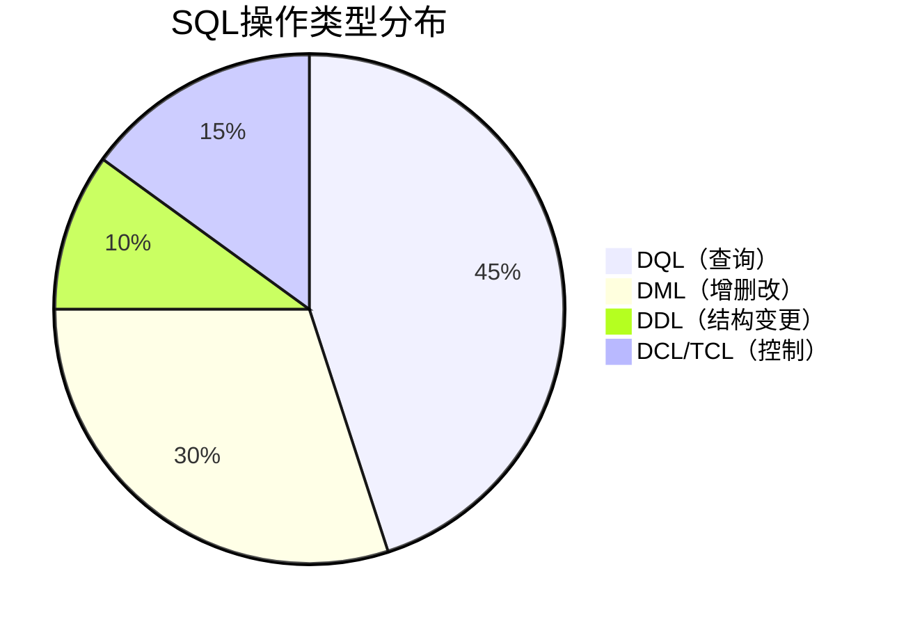

# 典型回答

ShardingJDBC中有一个负责路由的路由引擎，对于带有分片键的SQL，根据分片键的不同可以划分为：
- 单片路由(分片键的操作符是等号)
- 多片路由(分片键的操作符是IN)
- 范围路由(分片键的操作符是BETWEEN)。
**不携带分片键的SQL则采用广播路由**。

根据SQL类型，广播路由又可以划分为全库表路由、全库路由、全实例路由、单播路由和阻断路由这5种类型。


一般来说，我们用的是比较多的其实就是 DML操作了，**DML 操作的时候，主要做的就是全库表路由。**

也就是说，当查询语句没有使用分片键时，ShardingJDBC 会将查询语句广播到所有的分片中执行。这意味着每个分片都会独立执行一次查询，然后 ShardingJDBC 会将各个分片的结果汇总并返回给应用。

举个例子，我们的逻辑表t_order，对应的物理表是t_order_01，t_order_02，t_order_03，t_order_00，而你的 SQL 是：
```sql
SELECT * FROM t_order WHERE user_name = "Hollis";
```

那么他其实在执行时，执行的是以下 SQL：
```sql
SELECT * FROM t_order_00 WHERE user_name = "Hollis"
UNION
SELECT * FROM t_order_01 WHERE user_name = "Hollis"
UNION
SELECT * FROM t_order_02 WHERE user_name = "Hollis"
UNION
SELECT * FROM t_order_03 WHERE user_name = "Hollis"
```


# 补充

在数据库管理系统中，SQL 语言按功能被划分为多个子类别，主要包括 DDL、DML、DQL 等。以下是详细说明和相关概念：

### **核心概念分类**
#### 1. **DDL（Data Definition Language）数据定义语言**  
**功能**：定义和修改数据库结构  
**主要命令**：  
- `CREATE`：创建数据库对象（表、视图、索引等）  
  ```sql
  CREATE TABLE employees (
      id INT PRIMARY KEY,
      name VARCHAR(50)
  ```
- `ALTER`：修改现有对象结构  
  ```sql
  ALTER TABLE employees ADD salary DECIMAL(10,2)
  ```
- `DROP`：删除数据库对象  
  ```sql
  DROP TABLE employees
  ```
- `TRUNCATE`：快速清空表数据（保留结构）  
  ```sql
  TRUNCATE TABLE employees
  ```
- `RENAME`：重命名对象（部分数据库支持）  

**特点**：  
- 隐式提交事务（执行后立即生效）  
- 操作对象而非数据  

#### 2. **DML（Data Manipulation Language）数据操作语言**  
**功能**：操作数据库中的数据  
**主要命令**：  
- `INSERT`：插入新数据  
  ```sql
  INSERT INTO employees VALUES (1, 'Alice', 5000)
  ```
- `UPDATE`：修改现有数据  
  ```sql
  UPDATE employees SET salary=6000 WHERE id=1
  ```
- `DELETE`：删除数据  
  ```sql
  DELETE FROM employees WHERE id=1
  ```
- `MERGE`（UPSERT）：合并数据（存在则更新，不存在则插入）  

**特点**：  
- 需显式提交事务（`COMMIT`）  
- 操作数据本身  
- 可配合 `WHERE` 条件筛选  

#### 3. **DQL（Data Query Language）数据查询语言**  
**功能**：从数据库检索数据  
**唯一命令**：  
- `SELECT`：查询数据  
  ```sql
  SELECT name, salary FROM employees WHERE salary > 4000
  ```

**核心子句**：  
- `WHERE`：过滤条件  
- `JOIN`：多表关联  
- `GROUP BY`：分组聚合  
- `HAVING`：分组后过滤  
- `ORDER BY`：排序结果  

### **其他重要分类**
#### 4. **DCL（Data Control Language）数据控制语言**  
**功能**：权限管理和访问控制  
**主要命令**：  
- `GRANT`：授予权限  
  ```sql
  GRANT SELECT ON employees TO user1
  ```
- `REVOKE`：撤销权限  
  ```sql
  REVOKE DELETE ON employees FROM user1
  ```

#### 5. **TCL（Transaction Control Language）事务控制语言**  
**功能**：管理数据库事务  
**主要命令**：  
- `COMMIT`：提交事务（永久保存）  
- `ROLLBACK`：回滚事务（撤销操作）  
- `SAVEPOINT`：设置事务保存点  
  ```sql
  SAVEPOINT sp1;
  -- 执行操作...
  ROLLBACK TO sp1;  -- 回滚到保存点
  ```
- `SET TRANSACTION`：设置事务特性（如隔离级别）  

### **相关重要概念**
#### 数据库对象类型
| 对象           | 描述               | 操作命令                      |
| ------------ | ---------------- | ------------------------- |
| **Table**    | 数据存储的基本结构        | `CREATE/ALTER/DROP TABLE` |
| **View**     | 虚拟表（基于查询结果）      | `CREATE/DROP VIEW`        |
| **Index**    | 加速查询的数据结构        | `CREATE/DROP INDEX`       |
| **Sequence** | 自增数字生成器（Oracle等） | `CREATE SEQUENCE`         |
| **Trigger**  | 事件驱动的存储过程        | `CREATE TRIGGER`          |

#### 事务特性（ACID）
| 特性         | 描述                                                                 |
|--------------|----------------------------------------------------------------------|
| **Atomicity** (原子性) | 事务要么全部完成，要么全部回滚（`COMMIT/ROLLBACK` 保障）          |
| **Consistency** (一致性) | 事务前后数据库保持合法状态（约束保障）                              |
| **Isolation** (隔离性) | 并发事务相互隔离（通过锁机制实现）                                  |
| **Durability** (持久性) | 提交的事务永久保存（写入磁盘）                                      |

#### 其他关键名词
1. **约束（Constraints）**：
   - `PRIMARY KEY`：主键约束
   - `FOREIGN KEY`：外键约束
   - `UNIQUE`：唯一约束
   - `CHECK`：条件约束（如 `salary > 0`）
   - `NOT NULL`：非空约束

2. **存储过程（Stored Procedures）**：  
   预编译的SQL代码块，通过 `CALL` 执行

3. **触发器（Triggers）**：  
   自动响应数据变更的脚本（如 `AFTER INSERT`）

4. **游标（Cursors）**：  
   遍历查询结果集的指针

### **SQL操作全流程示例**
```sql
-- DDL：创建表
CREATE TABLE departments (
    dept_id INT PRIMARY KEY,
    dept_name VARCHAR(50)
);

-- DML：插入数据
INSERT INTO departments VALUES (10, 'IT');

-- DQL：查询数据
SELECT * FROM departments;

-- TCL：事务控制
COMMIT;

-- DCL：权限管理
GRANT SELECT ON departments TO report_user;
```

### **各语言在数据库操作中的占比**


理解这些分类有助于：  
1. 编写更规范的SQL代码  
2. 优化数据库性能（如DDL操作谨慎使用）  
3. 设计合理的权限管理体系  
4. 保证事务安全性和数据一致性

